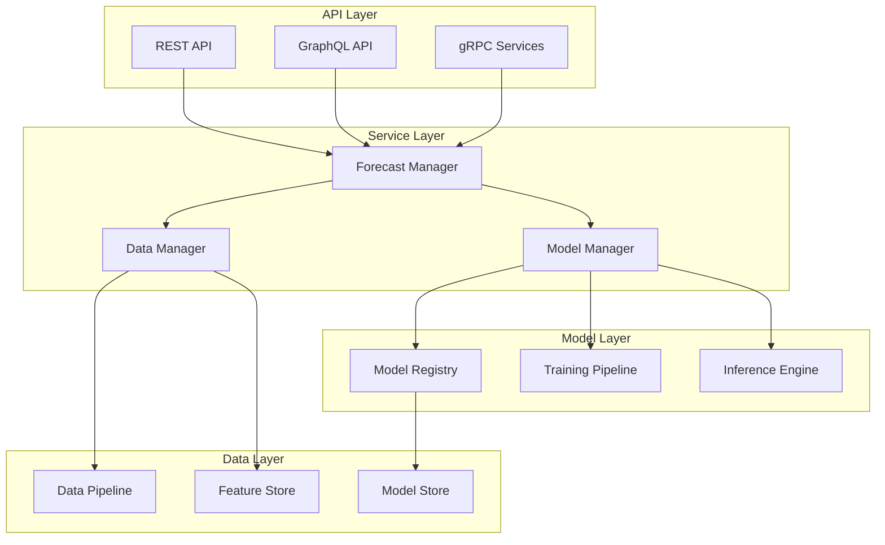
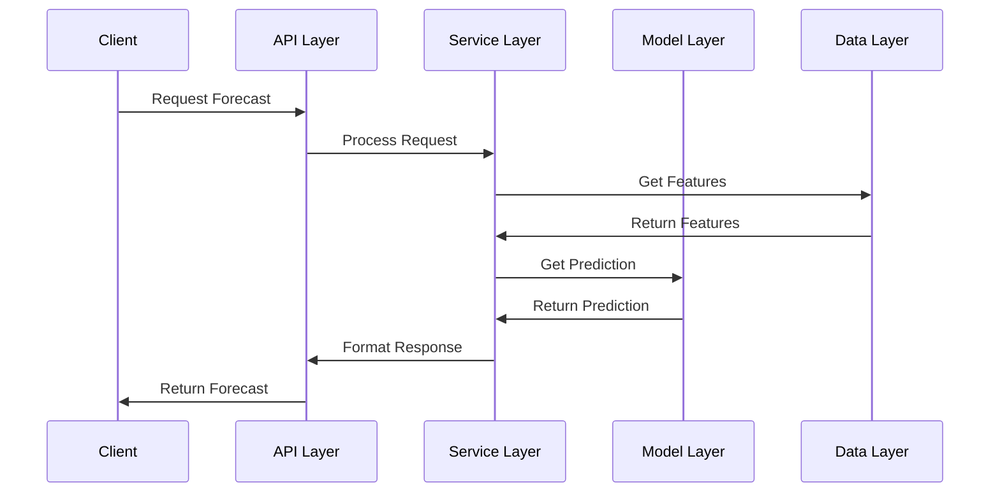
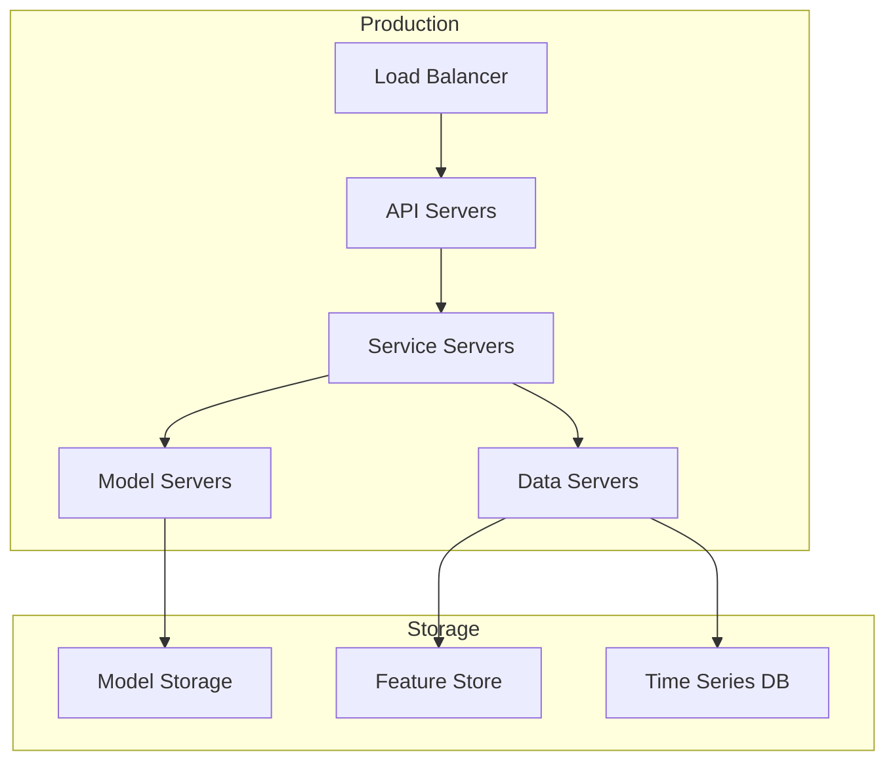

## System Architecture

The Forecast Service follows a layered architecture design that separates concerns and promotes modularity, scalability, and maintainability.

## Layer Descriptions

<AccordionGroup>
  <Accordion title="API Layer">
    - REST API endpoints
    - GraphQL interface
    - gRPC services
    - Authentication/Authorization
    - Request validation
  </Accordion>
  
  <Accordion title="Service Layer">
    - Business logic coordination
    - Request processing
    - Response formatting
    - Error handling
    - Service orchestration
  </Accordion>
  
  <Accordion title="Model Layer">
    - Model lifecycle management
    - Training coordination
    - Inference processing
    - Model versioning
    - Performance monitoring
  </Accordion>
  
  <Accordion title="Data Layer">
    - Data ingestion
    - Feature engineering
    - Data validation
    - Storage management
    - Cache coordination
  </Accordion>
</AccordionGroup>

## Component Interactions

### Request Flow

<Steps>
  <Step title="API Request">
    Client sends request through API endpoints
  </Step>
  <Step title="Service Processing">
    Request validation and business logic execution
  </Step>
  <Step title="Model Interaction">
    Model selection and inference processing
  </Step>
  <Step title="Data Access">
    Feature retrieval and data processing
  </Step>
</Steps>

## Key Components

<CardGroup cols={2}>
  <Card title="Model Registry" icon="book">
    - Model versioning
    - Metadata storage
    - Deployment tracking
    - Performance history
  </Card>
  <Card title="Feature Store" icon="database">
    - Feature management
    - Data versioning
    - Cache management
    - Access control
  </Card>
  <Card title="Training Pipeline" icon="gears">
    - Model training
    - Hyperparameter optimization
    - Validation process
    - Deployment automation
  </Card>
  <Card title="Inference Engine" icon="bolt">
    - Real-time predictions
    - Batch processing
    - Load balancing
    - Performance optimization
  </Card>
</CardGroup>

## Data Flow

## Scalability Design

<AccordionGroup>
  <Accordion title="Horizontal Scaling">
    - API load balancing
    - Service replication
    - Model distribution
    - Data partitioning
  </Accordion>
  
  <Accordion title="Vertical Scaling">
    - Resource allocation
    - Performance optimization
    - Cache management
    - Query optimization
  </Accordion>
  
  <Accordion title="Distributed Processing">
    - Batch processing
    - Parallel training
    - Distributed inference
    - Load distribution
  </Accordion>
</AccordionGroup>

## System Integration

<CardGroup cols={2}>
  <Card title="External Systems" icon="plug">
    - Weather services
    - Building management systems
    - Time series databases
    - Monitoring systems
  </Card>
  <Card title="Internal Services" icon="network-wired">
    - Authentication service
    - Logging service
    - Monitoring service
    - Storage service
  </Card>
</CardGroup>

## Deployment Architecture

## Security Architecture

<AccordionGroup>
  <Accordion title="Authentication">
    - API key management
    - Token-based auth
    - OAuth integration
    - Role management
  </Accordion>
  
  <Accordion title="Authorization">
    - Role-based access
    - Resource permissions
    - Scope management
    - Policy enforcement
  </Accordion>
  
  <Accordion title="Data Security">
    - Encryption at rest
    - Encryption in transit
    - Access logging
    - Audit trails
  </Accordion>
</AccordionGroup>

<Note>
  The architecture is designed for scalability, reliability, and maintainability. Regular review and updates ensure it meets evolving system requirements and performance needs.
</Note> 