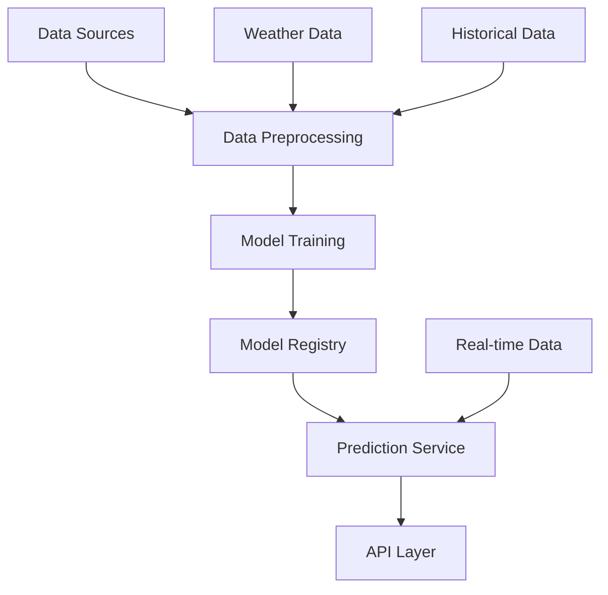

## Overview

The Forecast Service provides advanced prediction capabilities for the Alto platform, enabling proactive control and optimization of building systems. It uses machine learning models to forecast various parameters such as cooling demand, energy consumption, and environmental conditions.

## Features

<CardGroup cols={2}>
  <Card title="Load Prediction" icon="chart-line">
    Accurate forecasting of cooling and energy demands
  </Card>
  <Card title="Weather Integration" icon="cloud-sun">
    Weather-based prediction adjustments
  </Card>
  <Card title="Model Management" icon="brain">
    Automated model training and updates
  </Card>
  <Card title="Performance Analysis" icon="chart-simple">
    Forecast accuracy monitoring and improvement
  </Card>
</CardGroup>

## Service Architecture



## Key Components

<AccordionGroup>
  <Accordion title="Data Pipeline">
    - Data collection
    - Preprocessing
    - Feature engineering
    - Quality validation
  </Accordion>
  
  <Accordion title="Model Management">
    - Training pipeline
    - Model versioning
    - Performance tracking
    - Automated updates
  </Accordion>
  
  <Accordion title="Prediction Engine">
    - Real-time forecasting
    - Batch predictions
    - Uncertainty estimation
    - Ensemble methods
  </Accordion>
</AccordionGroup>

## Forecast Types

<CardGroup cols={2}>
  <Card title="Cooling Load" icon="temperature-half">
    Prediction of building cooling requirements
  </Card>
  <Card title="Energy Consumption" icon="bolt">
    Forecasting of energy usage patterns
  </Card>
  <Card title="Environmental" icon="cloud">
    Weather and environmental condition predictions
  </Card>
  <Card title="Equipment Performance" icon="gauge">
    Equipment efficiency and behavior forecasting
  </Card>
</CardGroup>

## Integration

### API Endpoints

```python
# Forecast request example
POST /api/v1/forecast
{
  "target": "cooling_load",
  "building_id": "building_01",
  "horizon": "24h",
  "resolution": "1h",
  "features": {
    "include_weather": true,
    "include_occupancy": true
  }
}

# Response structure
{
  "forecast": {
    "timestamps": [...],
    "values": [...],
    "confidence_intervals": {
      "lower": [...],
      "upper": [...]
    }
  },
  "metadata": {
    "model_version": "v1.2.3",
    "features_used": [...],
    "accuracy_metrics": {
      "mape": 0.15,
      "rmse": 45.2
    }
  }
}
```

## Model Performance

<AccordionGroup>
  <Accordion title="Accuracy Metrics">
    - Mean Absolute Percentage Error (MAPE)
    - Root Mean Square Error (RMSE)
    - R-squared (R²)
    - Forecast Skill Score
  </Accordion>
  
  <Accordion title="Validation Methods">
    - Cross-validation
    - Out-of-sample testing
    - Backtesting
    - Performance monitoring
  </Accordion>
</AccordionGroup>

## Best Practices

<Steps>
  <Step title="Data Quality">
    Ensure high-quality input data
  </Step>
  <Step title="Model Selection">
    Choose appropriate models for different forecasting tasks
  </Step>
  <Step title="Performance Monitoring">
    Regularly evaluate and update models
  </Step>
  <Step title="Integration Testing">
    Validate forecasts in the control system
  </Step>
</Steps>

## Service Management

<CardGroup cols={2}>
  <Card title="Monitoring" icon="chart-mixed">
    - Performance tracking
    - Resource utilization
    - Error rates
    - Response times
  </Card>
  <Card title="Maintenance" icon="wrench">
    - Model updates
    - Data pipeline checks
    - System health
    - Configuration management
  </Card>
  <Card title="Scaling" icon="arrows-up-down-left-right">
    - Load balancing
    - Resource allocation
    - Capacity planning
    - Performance optimization
  </Card>
  <Card title="Security" icon="shield">
    - Access control
    - Data protection
    - API security
    - Audit logging
  </Card>
</CardGroup>

<Note>
  The Forecast Service is a critical component for proactive building control. Regular monitoring and maintenance of models ensure reliable predictions for optimal system operation.
</Note> 