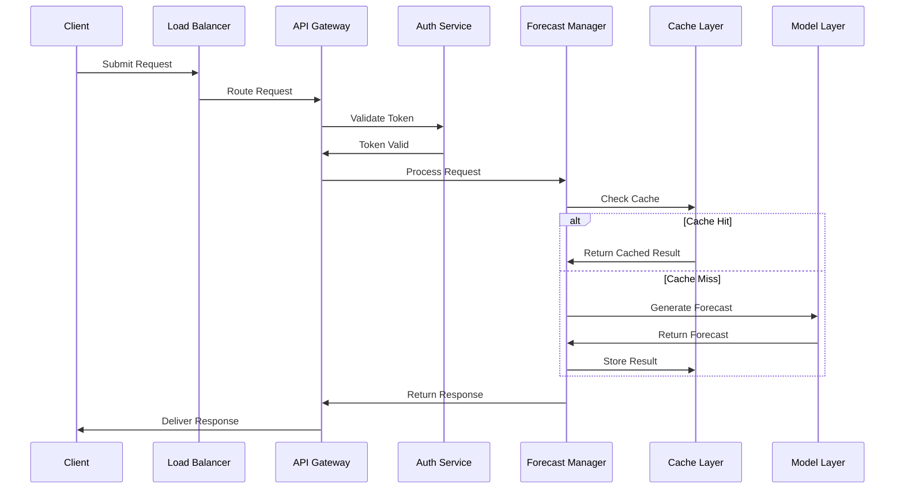

## Overview

The request flow in the Forecast Service follows a well-defined path from initial client request to final response delivery. This document details the complete lifecycle of a forecast request, including validation, processing, and error handling.

## Request Lifecycle



## Request Processing Stages

<Steps>
  <Step title="Request Reception">
    Initial request handling and load balancing
  </Step>
  <Step title="Authentication">
    Token validation and access control
  </Step>
  <Step title="Validation">
    Input validation and parameter checking
  </Step>
  <Step title="Processing">
    Forecast generation and result formatting
  </Step>
</Steps>

## API Endpoints

### Forecast Request

```python
POST /api/v1/forecast
Content-Type: application/json
Authorization: Bearer <token>

{
  "target": "cooling_load",
  "building_id": "building_01",
  "forecast_params": {
    "horizon": "24h",
    "resolution": "1h",
    "features": ["weather", "occupancy"]
  },
  "options": {
    "include_confidence": true,
    "return_features": false
  }
}
```

### Response Format

```python
{
  "request_id": "forecast_123",
  "status": "success",
  "data": {
    "forecast": {
      "timestamps": [
        "2024-01-17T00:00:00Z",
        "2024-01-17T01:00:00Z",
        // ...
      ],
      "values": [
        245.6,
        238.9,
        // ...
      ],
      "confidence_intervals": {
        "lower": [235.2, 228.1, ...],
        "upper": [256.0, 249.7, ...]
      }
    },
    "metadata": {
      "model_version": "v1.2.3",
      "generated_at": "2024-01-16T23:45:00Z",
      "accuracy_metrics": {
        "mape": 0.15,
        "rmse": 45.2
      }
    }
  }
}
```

## Request Validation

<AccordionGroup>
  <Accordion title="Authentication Checks">
    - API key validation
    - Token verification
    - Permission checking
    - Rate limiting
  </Accordion>
  
  <Accordion title="Input Validation">
    - Parameter validation
    - Data type checking
    - Range verification
    - Format validation
  </Accordion>
  
  <Accordion title="Business Rules">
    - Access permissions
    - Resource availability
    - Service limits
    - Feature flags
  </Accordion>
</AccordionGroup>

## Caching Strategy

<CardGroup cols={2}>
  <Card title="Cache Levels" icon="layer-group">
    - Result cache
    - Feature cache
    - Model cache
    - Metadata cache
  </Card>
  <Card title="Cache Policies" icon="gear">
    - TTL settings
    - Invalidation rules
    - Update strategies
    - Storage limits
  </Card>
  <Card title="Cache Keys" icon="key">
    - Key generation
    - Versioning
    - Namespacing
    - Partitioning
  </Card>
  <Card title="Cache Management" icon="screwdriver-wrench">
    - Cleanup
    - Monitoring
    - Optimization
    - Recovery
  </Card>
</CardGroup>

## Error Handling

### Error Types

<AccordionGroup>
  <Accordion title="Client Errors">
    - Invalid parameters
    - Authentication failures
    - Authorization errors
    - Rate limit exceeded
  </Accordion>
  
  <Accordion title="Service Errors">
    - Processing failures
    - Resource unavailable
    - Timeout errors
    - Integration issues
  </Accordion>
  
  <Accordion title="System Errors">
    - Infrastructure problems
    - Database errors
    - Network issues
    - Resource exhaustion
  </Accordion>
</AccordionGroup>

### Error Response Format

```python
{
  "request_id": "forecast_123",
  "status": "error",
  "error": {
    "code": "INVALID_PARAMETERS",
    "message": "Invalid forecast horizon specified",
    "details": {
      "parameter": "horizon",
      "reason": "Must be between 1h and 168h",
      "provided": "336h"
    }
  }
}
```

## Performance Optimization

<Steps>
  <Step title="Request Batching">
    Combine multiple requests for efficient processing
  </Step>
  <Step title="Parallel Processing">
    Distribute workload across available resources
  </Step>
  <Step title="Cache Optimization">
    Implement intelligent caching strategies
  </Step>
  <Step title="Resource Management">
    Optimize resource allocation and utilization
  </Step>
</Steps>

## Monitoring and Logging

<CardGroup cols={2}>
  <Card title="Request Tracking" icon="magnifying-glass">
    - Request ID tracking
    - Path tracing
    - Performance metrics
    - Error logging
  </Card>
  <Card title="Performance Metrics" icon="chart-line">
    - Response times
    - Success rates
    - Error rates
    - Resource usage
  </Card>
</CardGroup>

<Note>
  Understanding the request flow is crucial for system maintenance and optimization. Regular monitoring and analysis of request patterns help identify improvement opportunities.
</Note> 